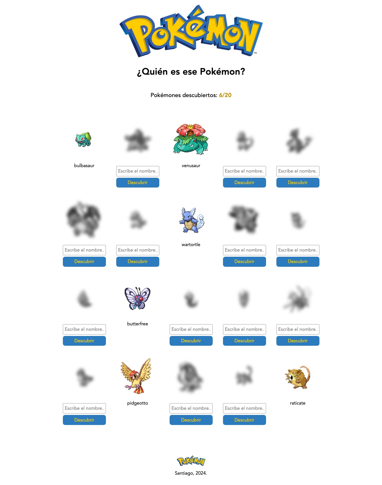

# Juego Pokémon con VueJS 🎮


Este proyecto fue desarrollado como parte de una prueba técnica para evaluar conocimientos en **Vue.js** y habilidades en el desarrollo de interfaces interactivas. La aplicación recrea una dinámica inspirada en la serie Pokémon, donde los usuarios deben adivinar el nombre de un Pokémon basándose en su silueta inicial. A través de esta aplicación, se exploran conceptos avanzados del framework, integrando una API externa para obtener datos dinámicos.

## Descripción del Proyecto

La aplicación permite a los usuarios interactuar con 20 Pokémon cargados dinámicamente desde la **PokéAPI**. Inicialmente, las imágenes tienen un filtro que oculta la identidad del Pokémon. Los usuarios pueden:

1. Ingresar el nombre del Pokémon a través de un input asociado a cada imagen.
2. Verificar su respuesta al presionar el botón **Descubrir** o al utilizar la tecla **Enter**:
   - Si el nombre es correcto, el filtro desaparece y se muestra el nombre del Pokémon.
   - Si el nombre es incorrecto, aparece una ventana emergente notificando el error.
3. Llevar un conteo de los Pokémon descubiertos correctamente.

## Requerimientos Técnicos

Durante el desarrollo, se implementaron las siguientes funcionalidades clave de **Vue.js**:

1. **Enlace de estado con templates**: Uso de directivas para sincronizar datos entre el estado y el DOM.
2. **Componentización**: Creación e importación de componentes hijos con comunicación mediante props.
3. **Renderizado dinámico**: Uso de `v-for` para iterar y renderizar múltiples elementos.
4. **Interactividad con eventos**: Enlace de eventos del DOM con métodos locales.
5. **Comunicación de componentes**: Envío de datos desde componentes hijos al padre.
6. **Renderizado condicional**: Mostrar y ocultar elementos de forma dinámica.
7. **Estilo dinámico**: Aplicación condicional de clases y estilos usando bindings.
8. **Consumo de API**: Uso de Axios para consumir datos de la **PokéAPI**.
9. **Ciclo de vida de Vue**: Ejecución de código al cargar la aplicación mediante hooks.
10. **Propiedades computadas**: Procesamiento de datos derivados del estado.

## Tecnologías Utilizadas

- **Framework**: Vue.js
- **API**: PokéAPI ([pokeapi.co](https://pokeapi.co))
- **Librería de peticiones HTTP**: Axios
- **Estilos CSS**: Filtros dinámicos para la ocultación inicial de imágenes.

## Cómo Ejecutar el Proyecto

1. Clona el repositorio:
   ```bash
   git clone https://github.com/tu-usuario/tu-repositorio.git

2. Instala node:
   ```bash
   npm install

3. Inicia la aplicación:
   ```bash
   npm run dev


## Captura de pantalla
